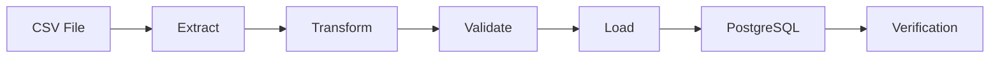

# ETL Pipeline with PostgreSQL

A simple ETL (Extract, Transform, Load) pipeline built with Python, Pandas, PostgreSQL, SQLAlchemy, Docker, and Docker Compose. This project demonstrates how to extract data from a CSV file, clean and transform it, load it into a PostgreSQL database, and verify the loaded data.

---

## Features

- Extract data from CSV
- Transform and clean data using Pandas
- Load data into PostgreSQL
- Data validation and quality checks
- ETL logging
- Load verification
- Dockerized application
- Docker Compose for multi-container orchestration

---

## Tech Stack

- Python 3.11
- Pandas
- PostgreSQL
- SQLAlchemy
- Docker
- Docker Compose

---

## Project Architecture



---

## Project Structure

```text
etl-postgresql-pipeline/
│
├── data/
│   └── Sample - Superstore.csv
│
├── logs/
│   └── etl.log
│
├── output/
│
├── sql/
│
├── src/
│   ├── config.py
│   ├── database.py
│   ├── extract.py
│   ├── transform.py
│   ├── validate.py
│   ├── load.py
│   ├── logger.py
│   └── main.py
│
├── Dockerfile
├── docker-compose.yml
├── requirements.txt
└── README.md
```

---

## ETL Workflow

1. Extract data from CSV
2. Clean and transform data
3. Validate dataset quality
4. Load data into PostgreSQL
5. Verify loaded records
6. Generate ETL logs

---

## Run the Project

Build and start the containers:

```bash
docker compose up --build
```

Stop the containers:

```bash
docker compose down
```

---

## Current Progress

- Extract
- Transform
- Data Validation
- Load to PostgreSQL
- Verification
- Logging
- Dockerized ETL Pipeline